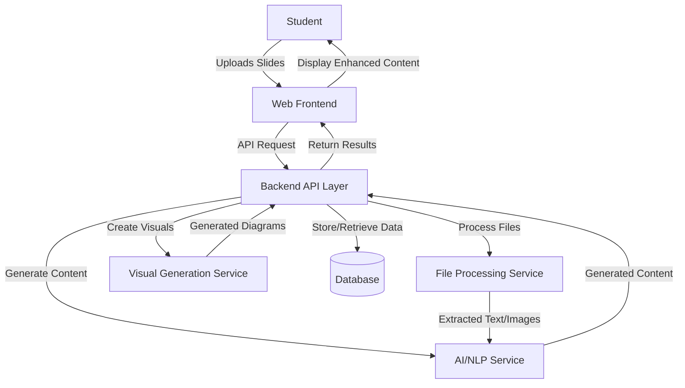
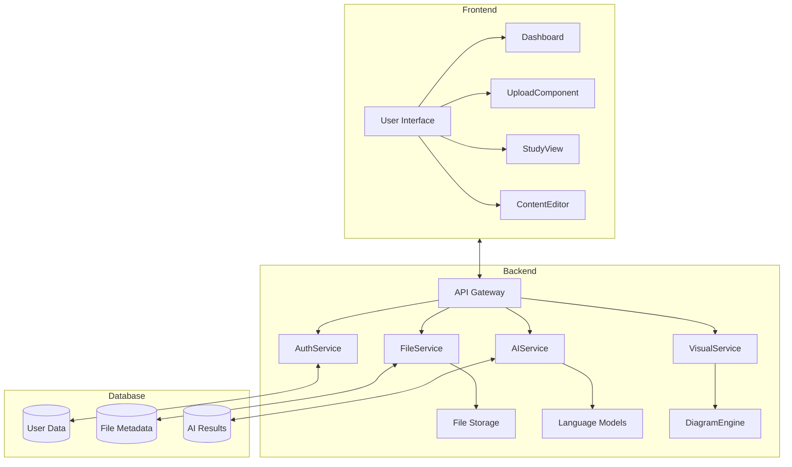
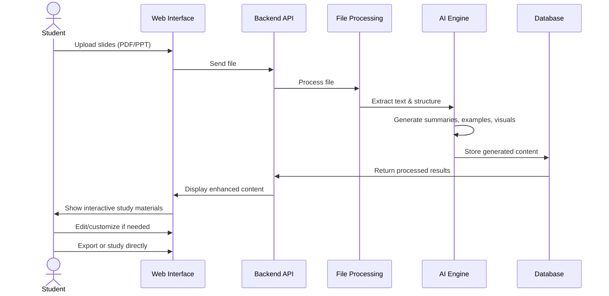
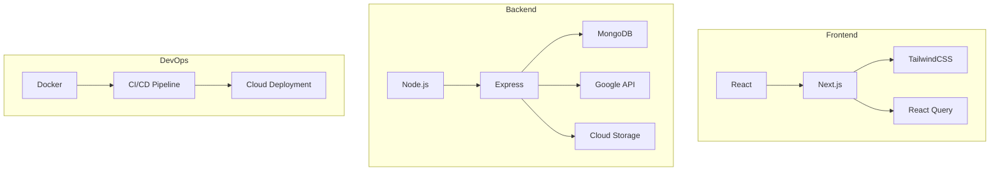

# LecSlide

> **Transform lecture slides into interactive, AI-powered study resources**

LecSlide is a student-centric platform that leverages AI to enhance learning by converting static lecture slides into dynamic study materials with summaries, concept maps, practice questions, and visual aids.

## Table of Contents
- [Vision](#vision)
- [Features](#features)
- [Architecture](#architecture)
- [User Workflow](#user-workflow)
- [Getting Started](#getting-started)
- [Tech Stack](#tech-stack)
- [Contributing](#contributing)
- [License](#license)

## Vision

> "To help students grasp lecture content more fully by generating concise summaries, interactive examples, and custom visual aids from existing slides, ultimately improving study effectiveness."

## Features

### Core Features

1. **AI-Powered Summarization**
   - Extract essential information from slides
   - Generate concise bullet points and paragraphs
   - Create concept maps showing relationships between topics

2. **Interactive Examples & Visual Aids**
   - Automatically generate diagrams, flowcharts, and timelines
   - Create practice questions based on slide content
   - Provide discipline-specific examples (code snippets for CS, problem solutions for STEM)

3. **User-Centric Experience**
   - Simple drag-and-drop interface for slide uploads
   - Support for PDF, PPT, and PPTX formats
   - Customizable outputs and editable AI-generated content

4. **Discipline Customization**
   - Specialized templates for different academic fields
   - Domain-aware AI responses tailored to the subject matter

## Architecture

### System Overview



### Component Architecture



## User Workflow



## Getting Started

### Prerequisites
- Node.js (v16+)
- npm or yarn
- MongoDB

### Installation

```bash
# Clone the repository
git clone https://github.com/jaffarkeikei/LecSlide.git
cd LecSlide

# Install dependencies
npm install

# Setup environment variables
cp .env.example .env
# Edit .env with your configuration

# Start development server
npm run dev

```

## Tech Stack



## Contributing

Contributions are welcome! Please feel free to submit a Pull Request.

## License

This project is licensed under the MIT License - see the LICENSE file for details. 