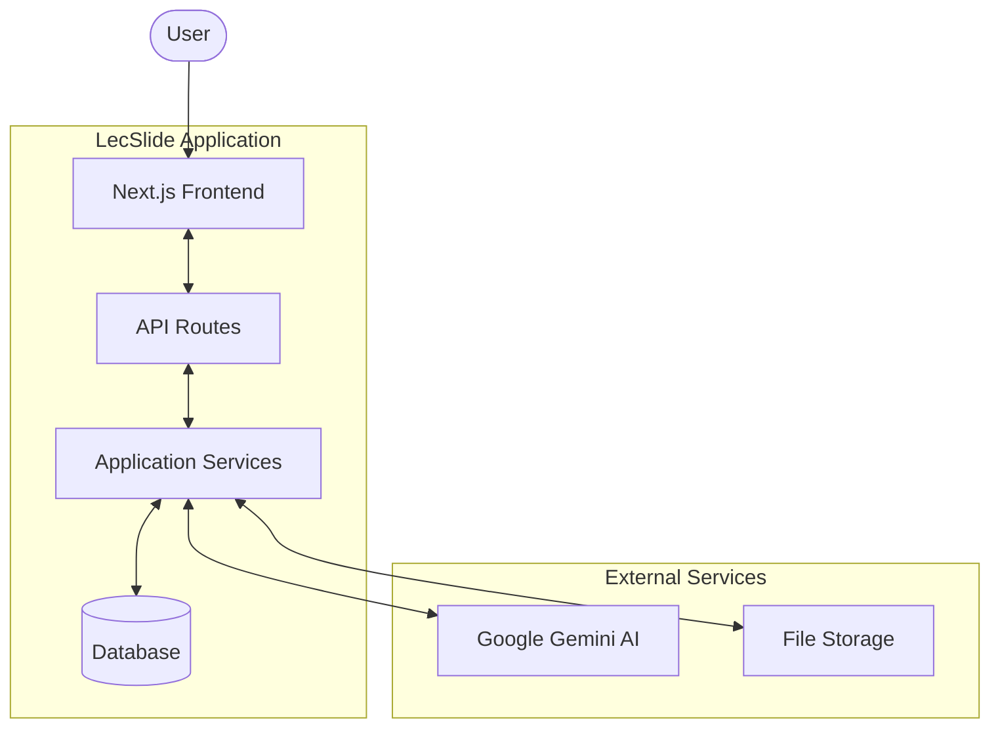
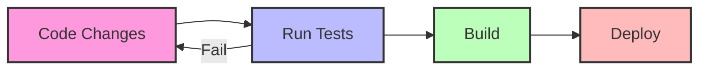

# LecSlide Documentation

Welcome to the LecSlide documentation! This comprehensive guide provides detailed information about the architecture, components, and functionality of the LecSlide application.

## Table of Contents

1. [Architecture Overview](architecture.md)
   - System Architecture
   - Application Flow
   - Component Architecture
   - Data Model
   - Technology Stack

2. [UI Components](components.md)
   - Component Overview
   - Core Components
     - FileUploader
     - ProcessingSteps
     - SlideViewer
     - SummaryCard
     - ConceptMap
     - PracticeQuestions
   - Component Interaction Example

3. [AI Integration](ai-integration.md)
   - AI Service Architecture
   - AI Processing Pipeline
   - AI Service Functions
   - Prompt Engineering
   - Response Parsing
   - Error Handling

4. [File Processing & Export](file-processing.md)
   - File Processing Architecture
   - File Processing Flow
   - Input File Processing
   - Export Functionality
   - Export Service Functions
   - Handling Different Formats
   - Error Handling

5. [Testing](testing.md)
   - Testing Architecture
   - Test Directory Structure
   - Testing Approach
   - Test Coverage
   - Mock Strategies
   - Testing Examples
   - Test Configuration

## Getting Started

To set up LecSlide for development:

1. Clone the repository
2. Install dependencies: `npm install`
3. Set up environment variables: Copy `.env.example` to `.env.local`
4. Run the development server: `npm run dev`

## Architecture Diagram

## Key Features

- **PDF and PowerPoint Extraction**: Extract content from presentation files
- **AI-Enhanced Learning Materials**: Generate summaries, key points, and practice questions
- **Interactive Concept Maps**: Visualize relationships between key concepts
- **Practice Questions**: Test knowledge with auto-generated quiz questions
- **Export Functionality**: Export enhanced materials in multiple formats

## Development Workflow

