# AI Integration Documentation

LecSlide leverages Google's Gemini AI to transform presentation content into valuable learning materials. This document details how AI is integrated into the application.

## AI Service Architecture

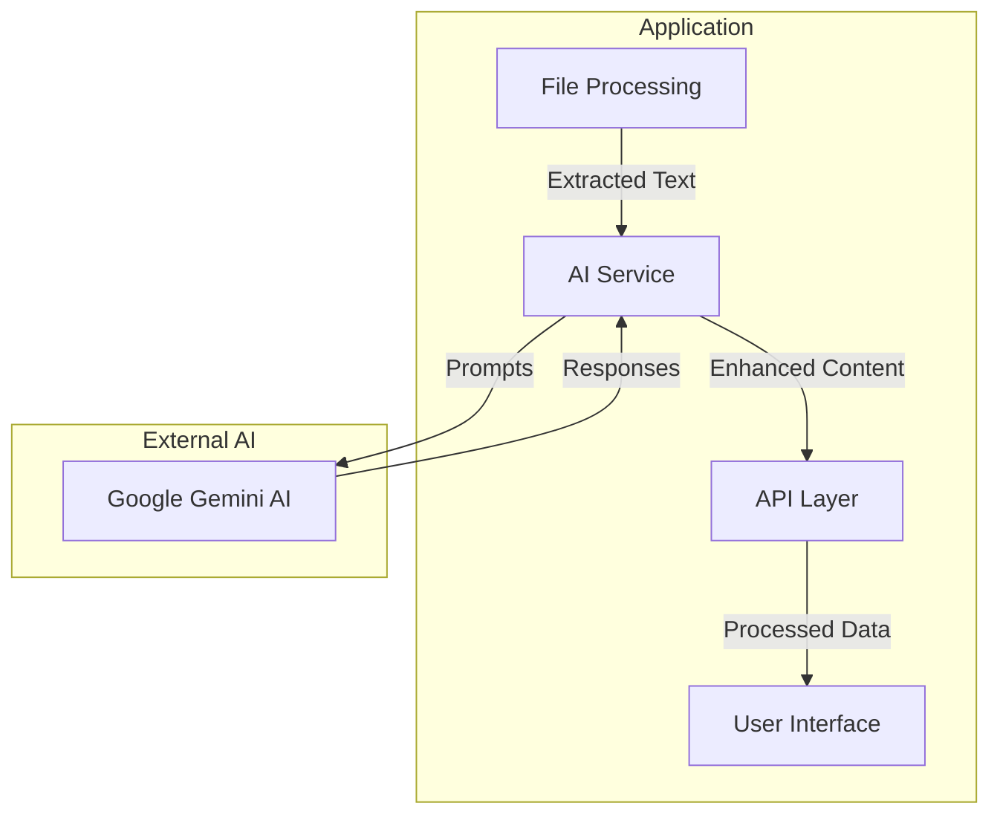

## AI Processing Pipeline

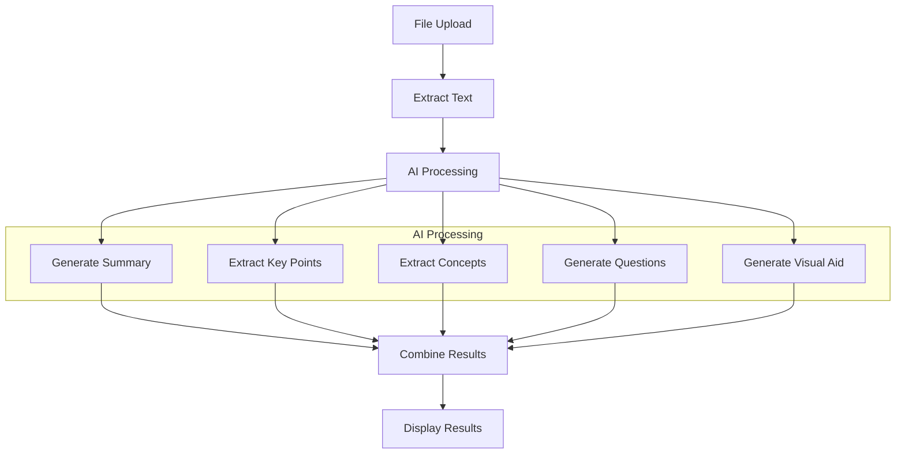

## AI Service Functions

The AI service (`aiService.ts`) provides several functions that interact with the Gemini AI model:

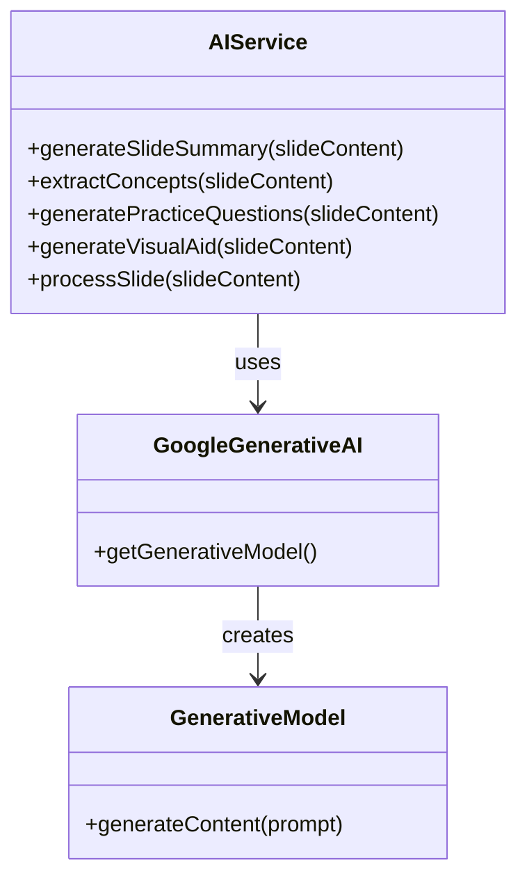

### Function Details

#### generateSlideSummary

This function creates a concise summary and key points from slide content.

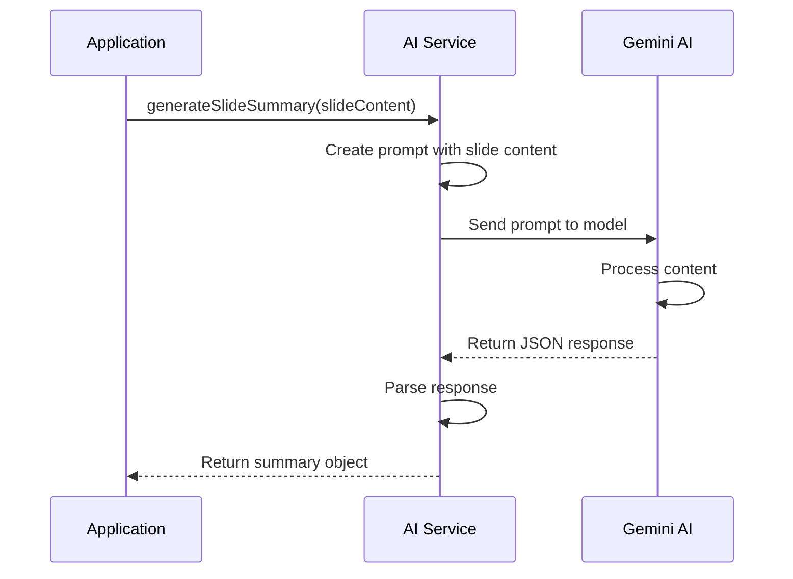

Input/Output:
```javascript
// Input
const slideContent = {
  title: "Introduction to AI",
  content: "Artificial intelligence (AI) is intelligence demonstrated by machines..."
};

// Output
const result = {
  summary: "AI refers to the simulation of human intelligence in machines...",
  keyPoints: [
    "AI uses algorithms to process data",
    "Machine learning is a subset of AI",
    "Neural networks are inspired by the human brain"
  ]
};
```

#### extractConcepts

This function identifies and defines key concepts from the slide content.

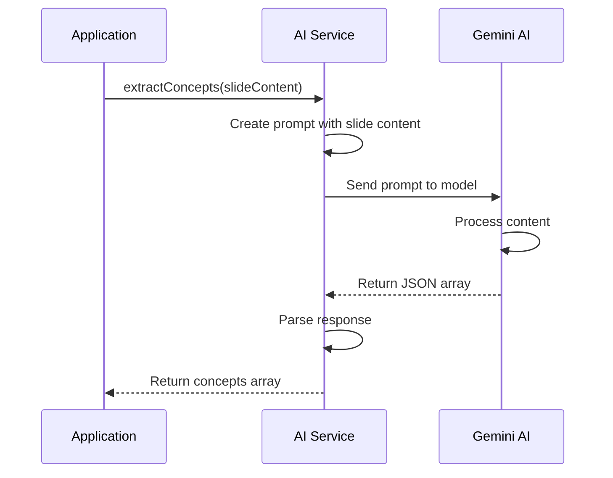

#### generatePracticeQuestions

This function creates interactive quiz questions based on slide content.

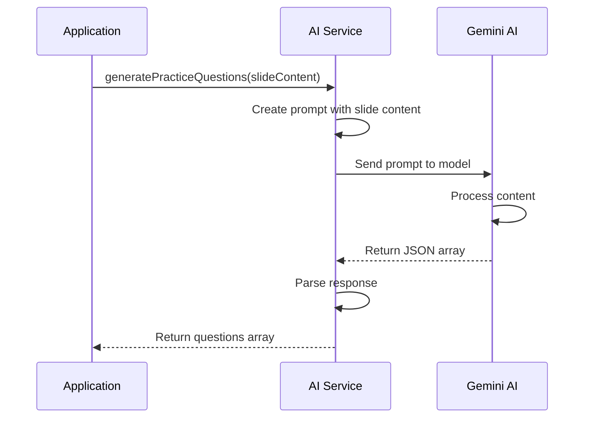

#### generateVisualAid

This function creates a visual representation of the concepts or process described in the slide.

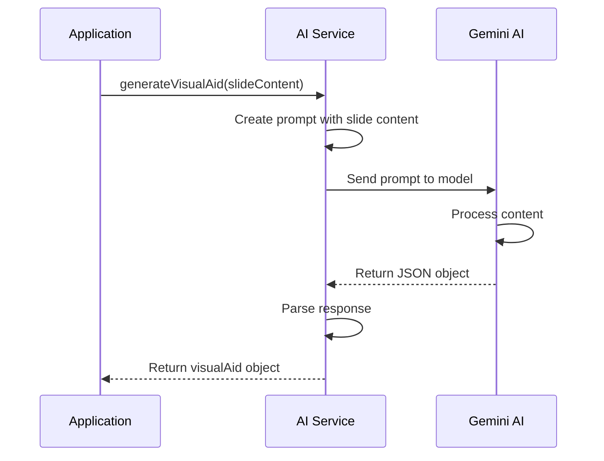

#### processSlide

This function combines all AI processing for a single slide.

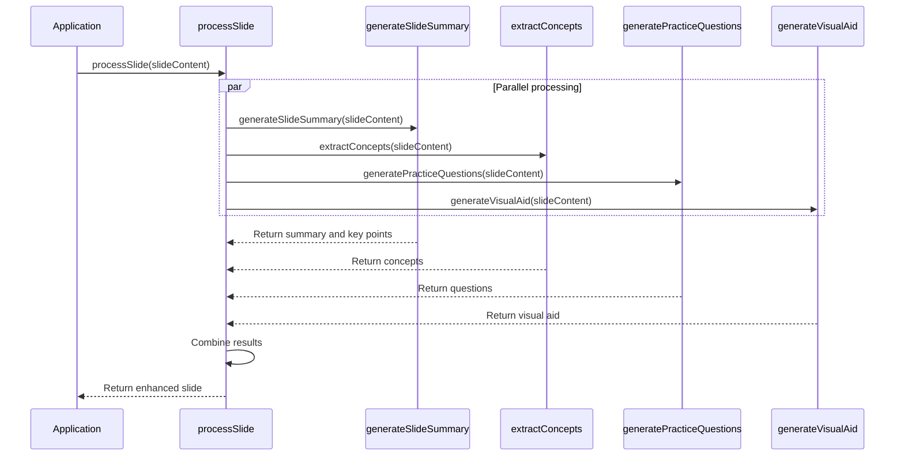

## Prompt Engineering

LecSlide uses structured prompts to get consistent, formatted responses from the Gemini AI model.

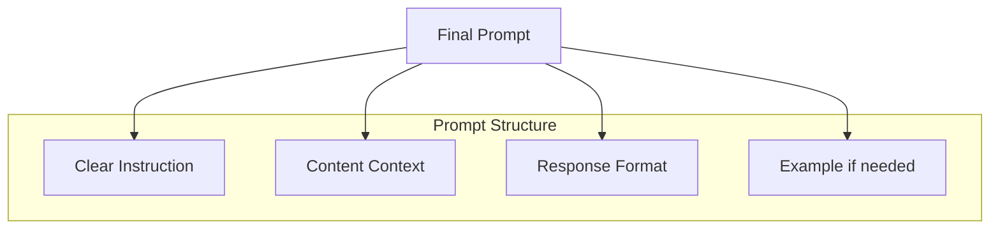

Example prompt for summary generation:
```
Generate a concise summary and key points for the following slide content:

Title: {slide.title}
Content: {slide.content}

Respond with a JSON object with the following format:
{
  "summary": "A one-paragraph summary of the slide content",
  "keyPoints": ["Key point 1", "Key point 2", "Key point 3", "Key point 4"]
}
```

## Response Parsing

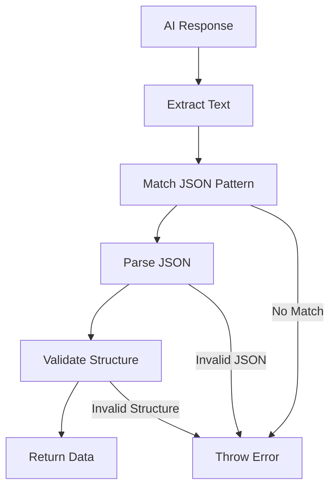

## Error Handling

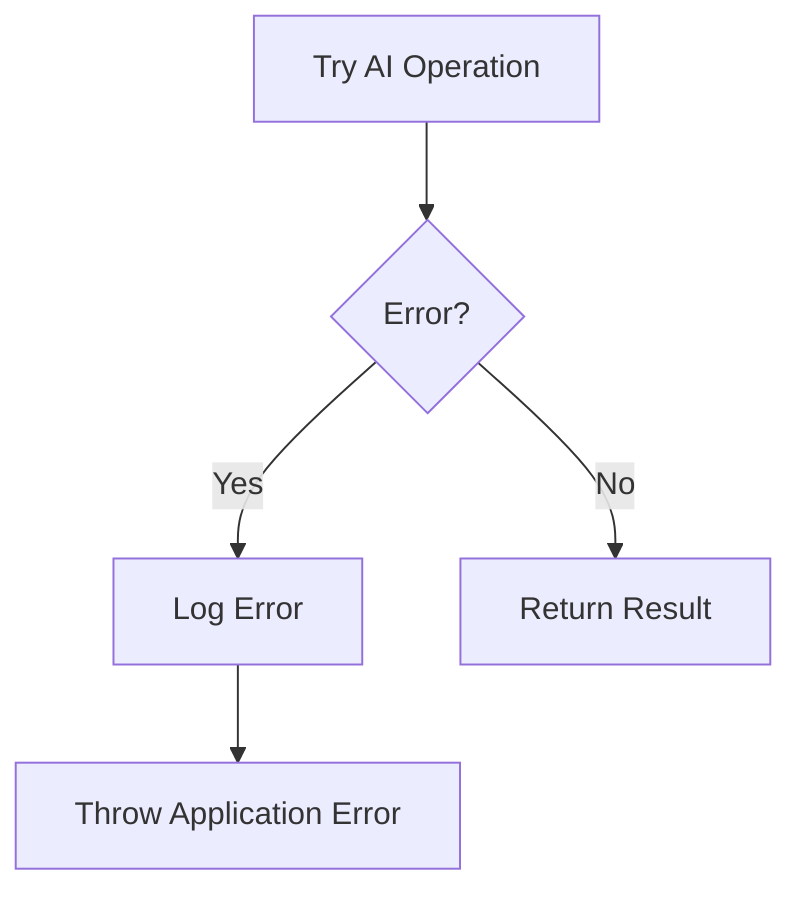