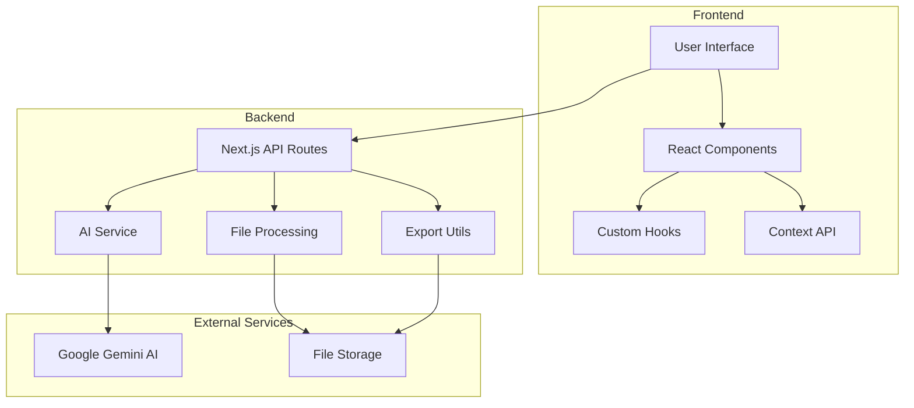
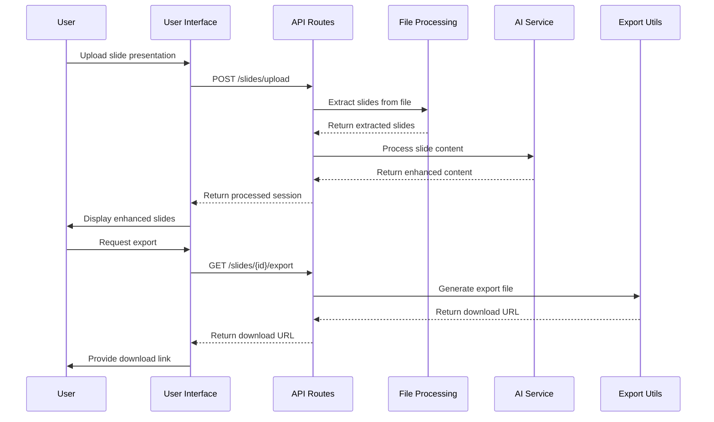
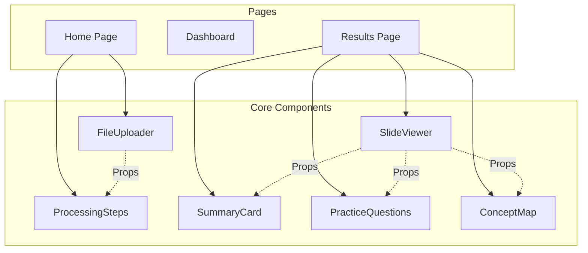
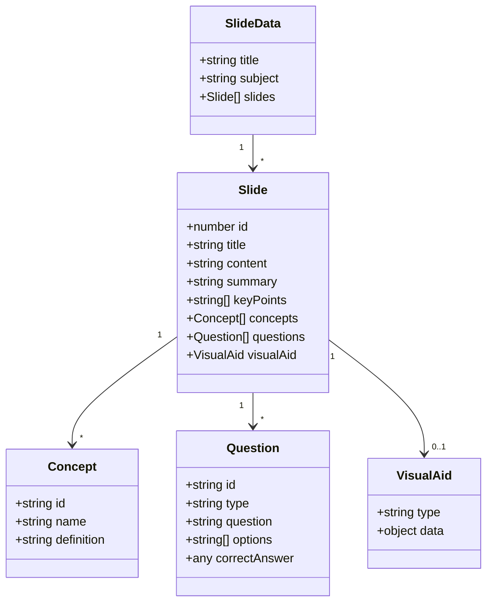
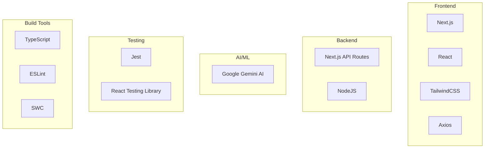

# LecSlide Architecture Documentation

LecSlide is a Next.js application designed to transform presentation files (PDF, PowerPoint) into interactive learning materials with AI-enhanced features.

## System Architecture

## Application Flow

## Component Architecture

## Data Model

## Technology Stack

