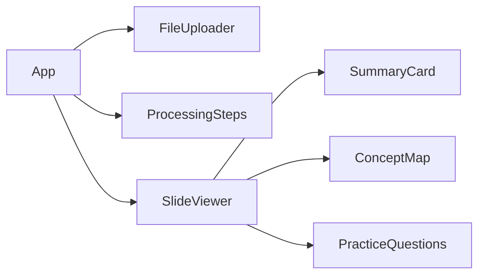
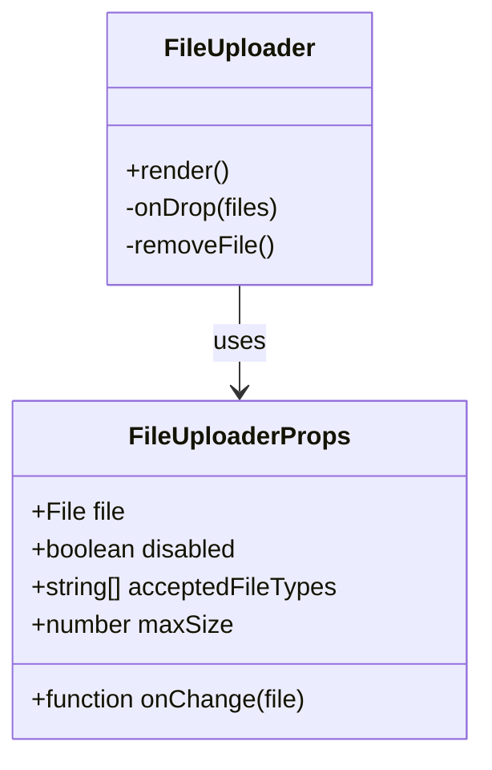
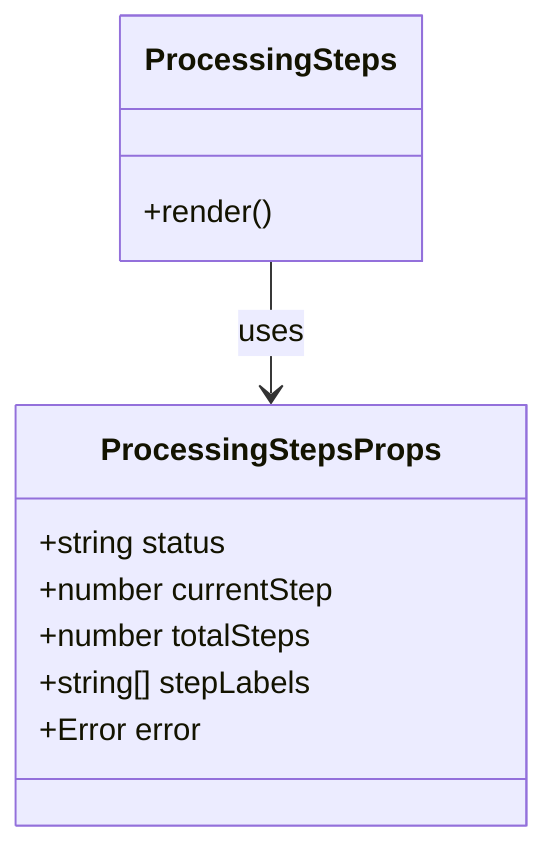
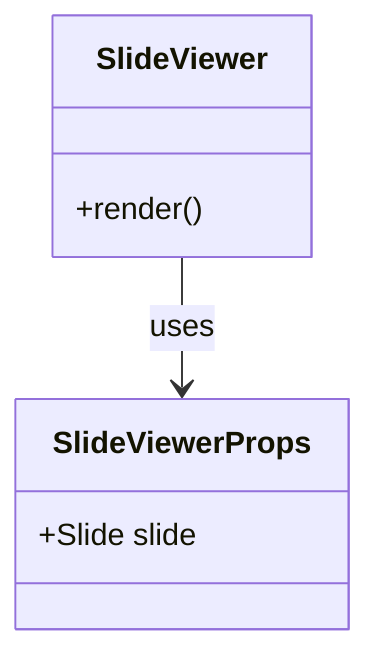
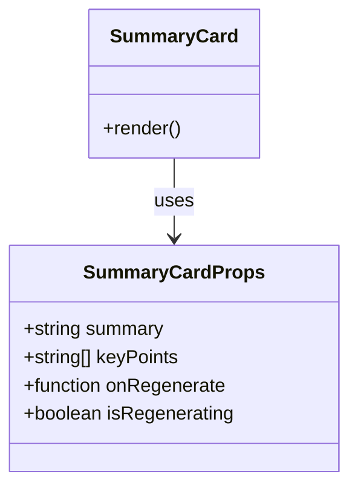
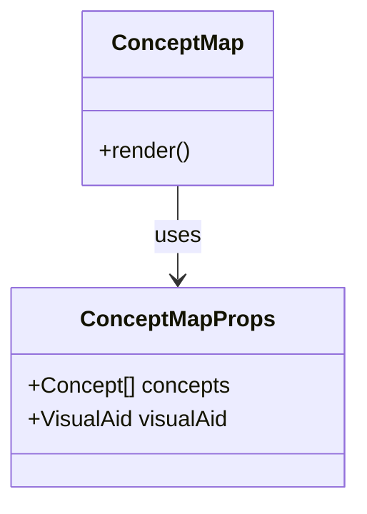
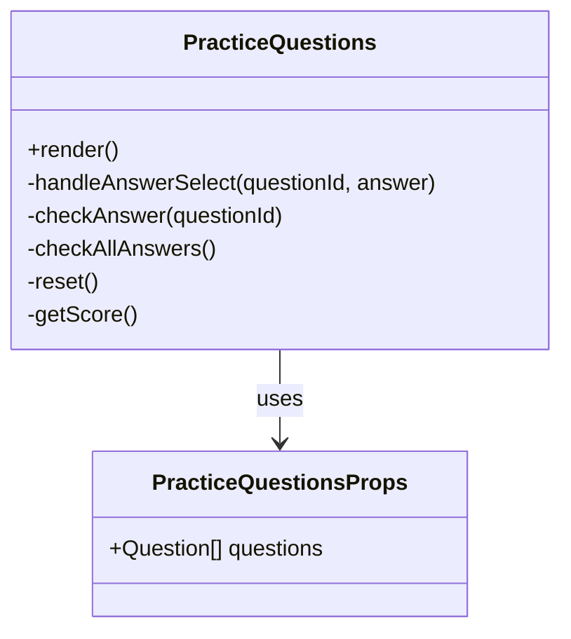
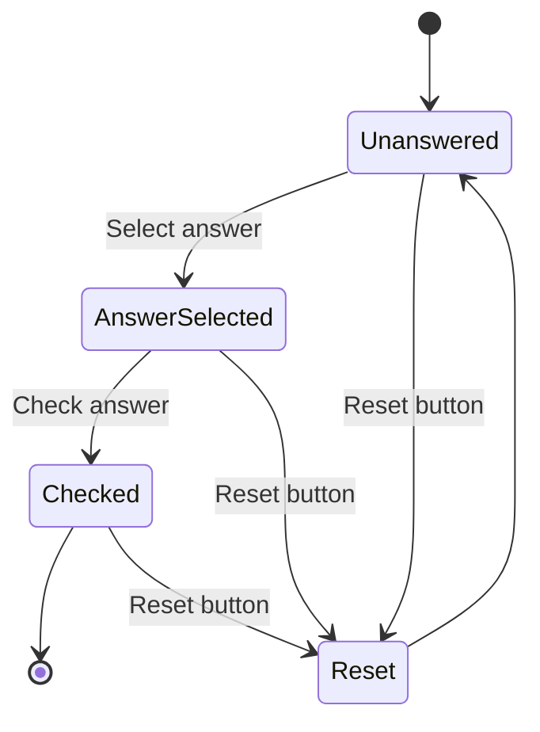
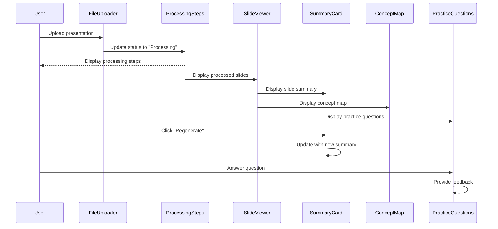

# UI Components Documentation

LecSlide uses a set of React components to build its user interface. This document provides detailed information about each component, its props, and its role in the application.

## Component Overview

## Core Components

### FileUploader

The FileUploader component handles file selection and validation for presentation uploads.

**Key Features:**
- Drag and drop interface
- File type validation (.pdf, .ppt, .pptx)
- Size limit enforcement (default 20MB)
- Visual feedback for file selection
- Error messaging for invalid files

### ProcessingSteps

The ProcessingSteps component displays the current status of file processing.

**Key Features:**
- Visual indication of processing stages
- Progress tracking
- Error state handling
- Step completion feedback

### SlideViewer

The SlideViewer component displays the content of individual slides.

**Key Features:**
- Clean presentation of slide content
- Responsive layout
- Styling consistent with presentation format

### SummaryCard

The SummaryCard component displays AI-generated summaries of slide content.

**Key Features:**
- Concise presentation of summaries
- Bulleted list of key points
- Optional regeneration button
- Loading state for regeneration

### ConceptMap

The ConceptMap component visualizes relationships between key concepts using a force-directed graph.

**Key Features:**
- Interactive graph visualization
- Nodes representing concepts
- Edges representing relationships
- Customizable appearance

### PracticeQuestions

The PracticeQuestions component displays interactive quiz questions based on slide content.

**State Management:**

**Key Features:**
- Multiple choice questions
- True/false questions
- Immediate feedback
- Score tracking
- Answer validation
- Reset functionality

## Component Interaction Example

The following diagram shows how components interact during a typical user flow:

