# File Processing and Export Documentation

LecSlide includes robust file processing capabilities for both input (PDF, PowerPoint) and output (markdown, HTML, PDF) documents. This document details these processes.

## File Processing Architecture

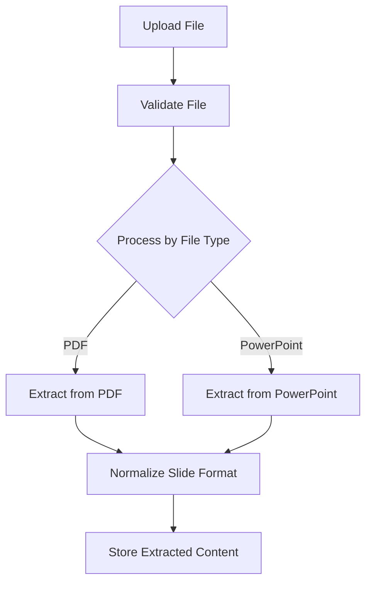

## File Processing Flow

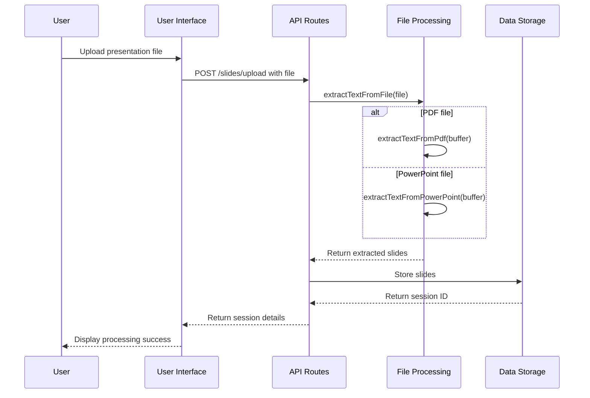

## Input File Processing

### PDF Processing

LecSlide uses `pdf-lib` to extract content from PDF files.

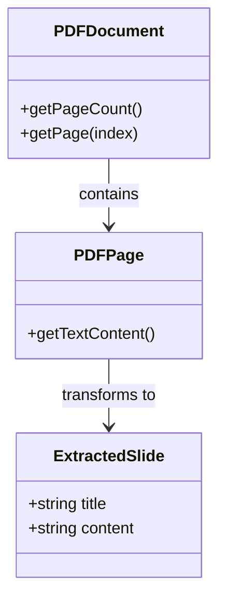

### PowerPoint Processing

For PowerPoint files, LecSlide uses specialized libraries to extract slide content.

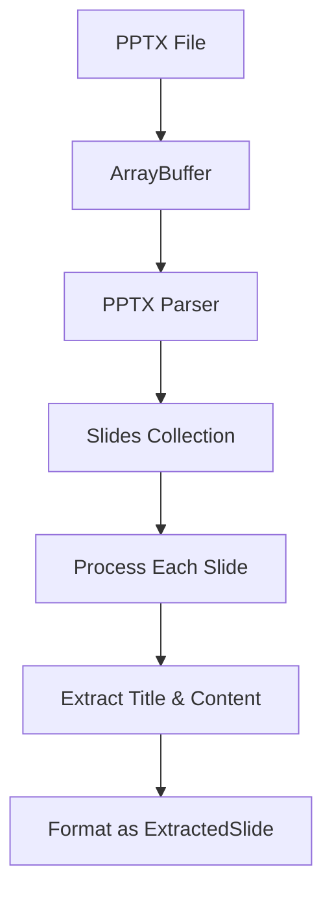

## Export Functionality

LecSlide provides multiple export formats for enhanced slide content.

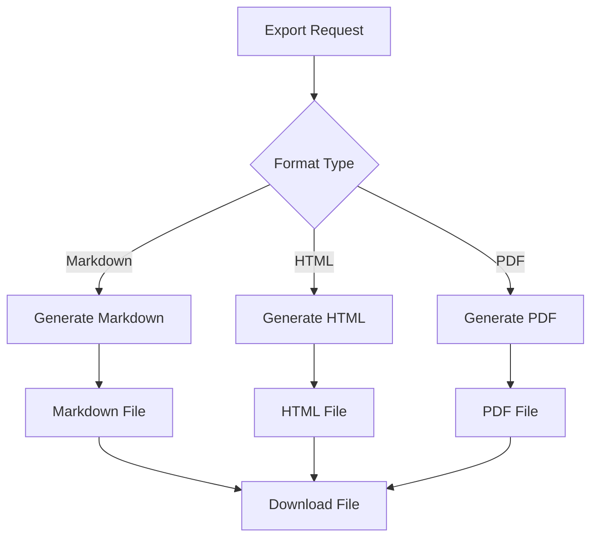

### Export Service Functions

The export utilities in `exportUtils.ts` provide functions for generating different output formats:

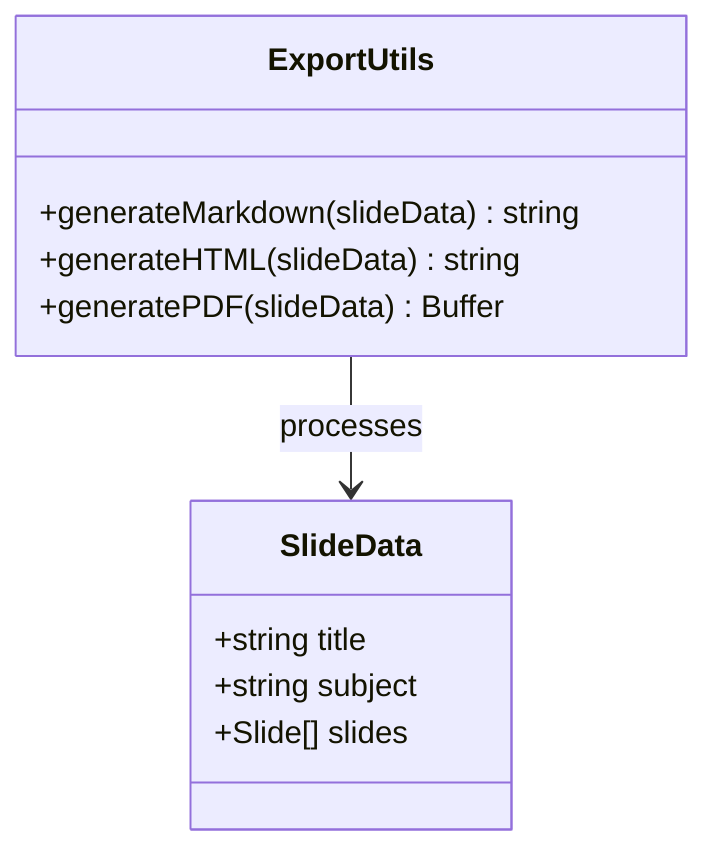

### Markdown Generation

The markdown export creates a structured document with all slide content:

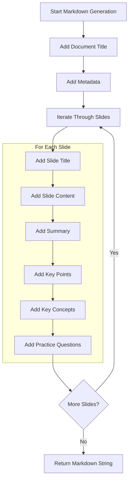

### HTML Generation

The HTML export creates a styled, interactive document:

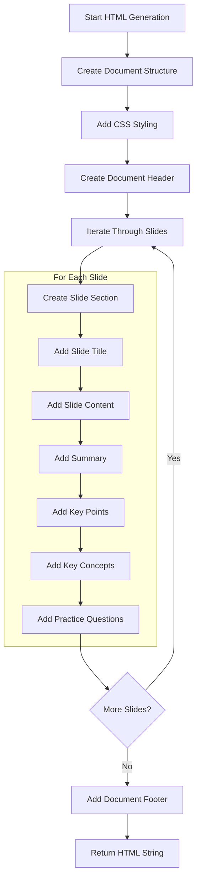

### PDF Generation

The PDF export builds on the HTML output and converts it to a PDF document:

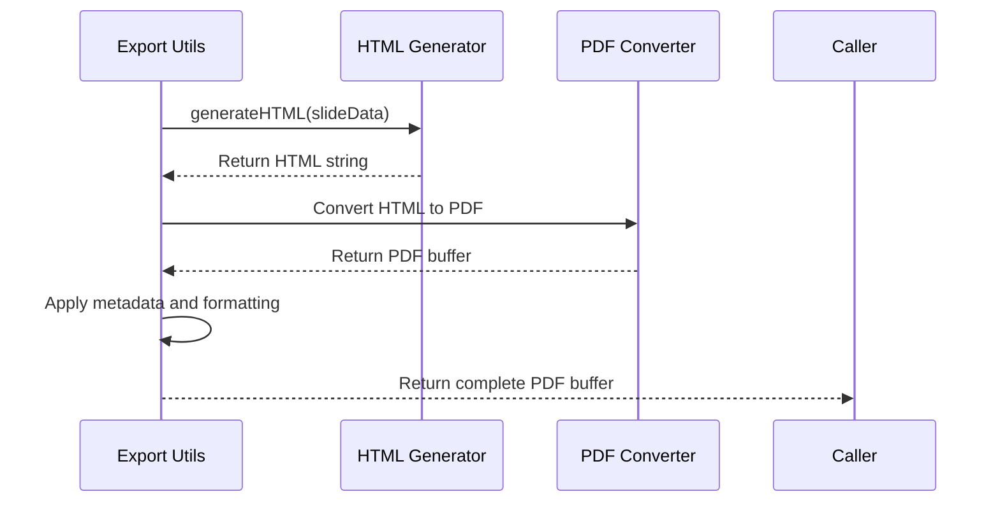

## Handling Different Question Types

When exporting content, question formats are handled differently based on the export format:

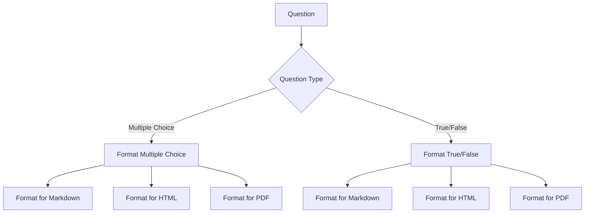

## Error Handling

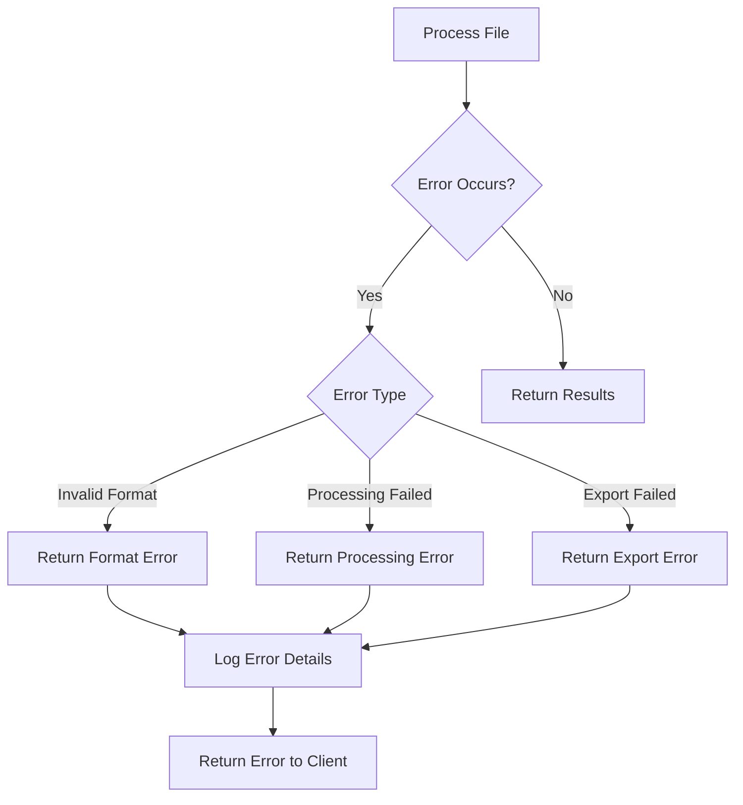