# Testing Documentation

LecSlide implements a comprehensive testing strategy using Jest and React Testing Library. This document outlines the testing approach, coverage, and examples.

## Testing Architecture

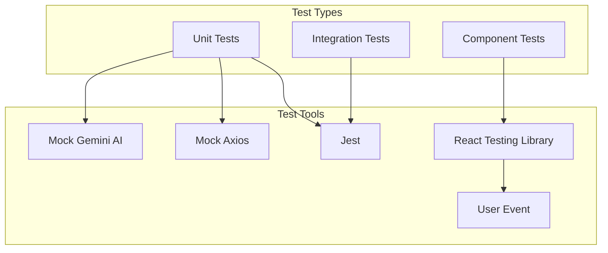

## Test Directory Structure

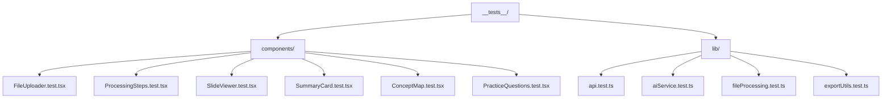

## Testing Approach

### Component Testing

Components are tested using React Testing Library to ensure they render correctly and respond to user interactions as expected. The following diagram illustrates the component testing flow:

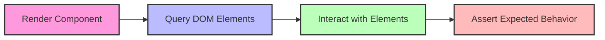

Example pattern for component testing:

```jsx
// 1. Render the component with test props
render(<Component {...testProps} />);

// 2. Query elements from the rendered output
const element = screen.getByText('Expected text');

// 3. Interact with elements (if needed)
await userEvent.click(element);

// 4. Assert expected behavior
expect(screen.getByText('New state')).toBeInTheDocument();
```

### API Service Testing

API services are tested by mocking the Axios library to ensure proper request formation and response handling.

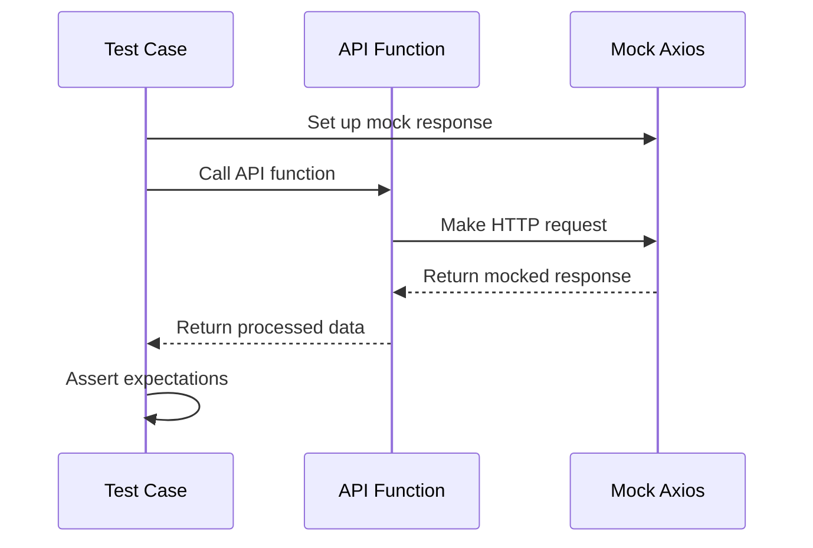

### AI Service Testing

The AI service is tested by mocking the Google Generative AI client to ensure proper prompt construction and response parsing.

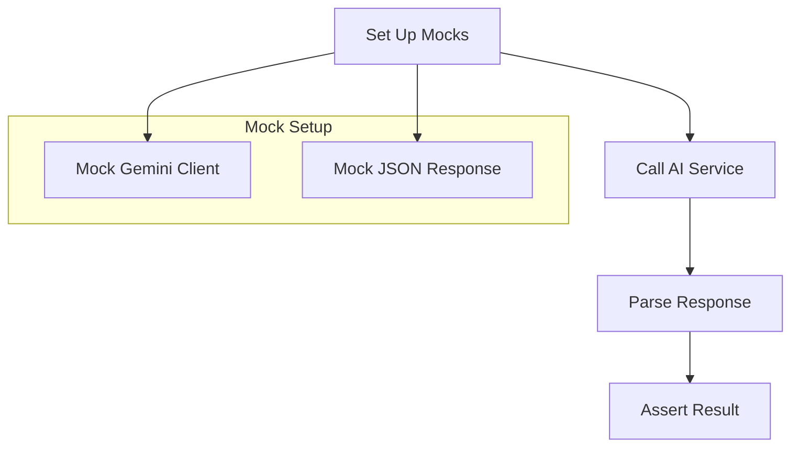

## Test Coverage

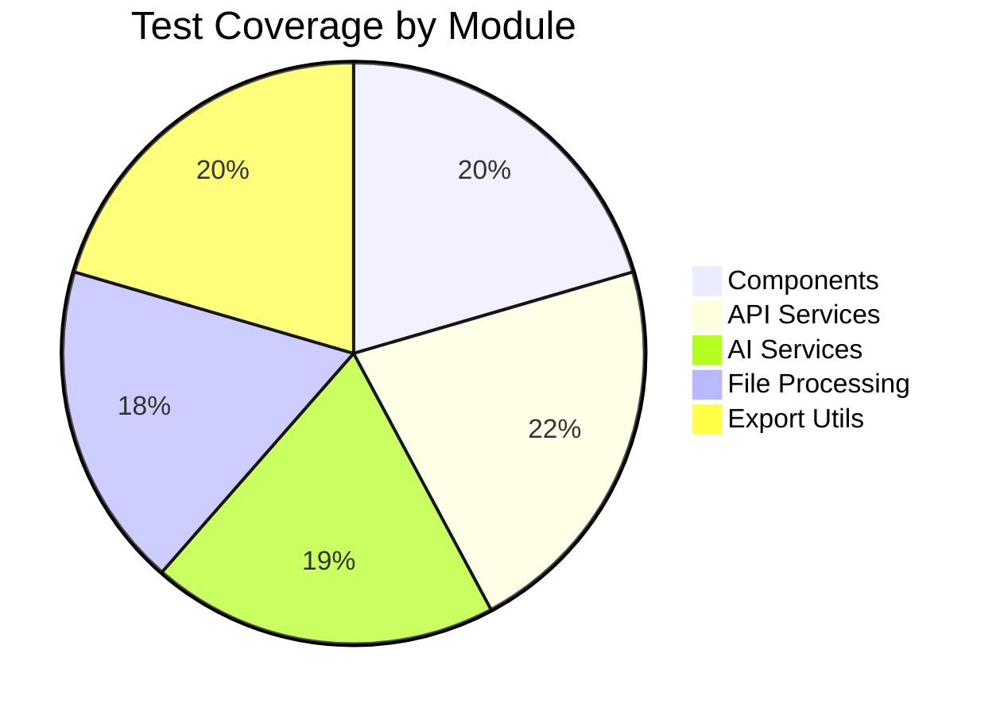

## Mock Strategies

### Mocking Axios

Axios is mocked to simulate API responses without making actual HTTP requests:

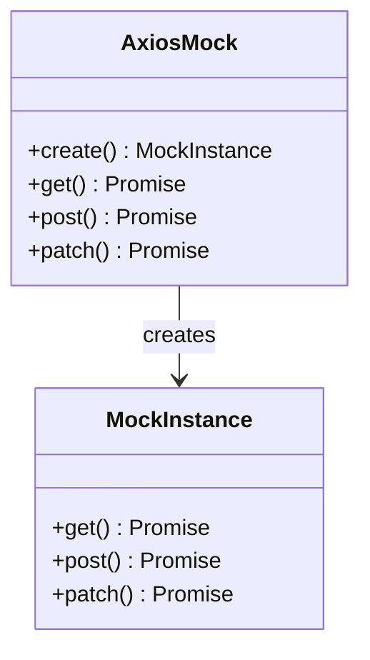

### Mocking Google Generative AI

The Google Generative AI client is mocked to provide consistent responses for AI-driven features:

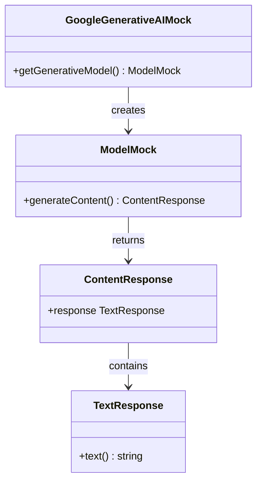

## Testing Examples

### Component Tests

Here's a visualization of the PracticeQuestions component test:

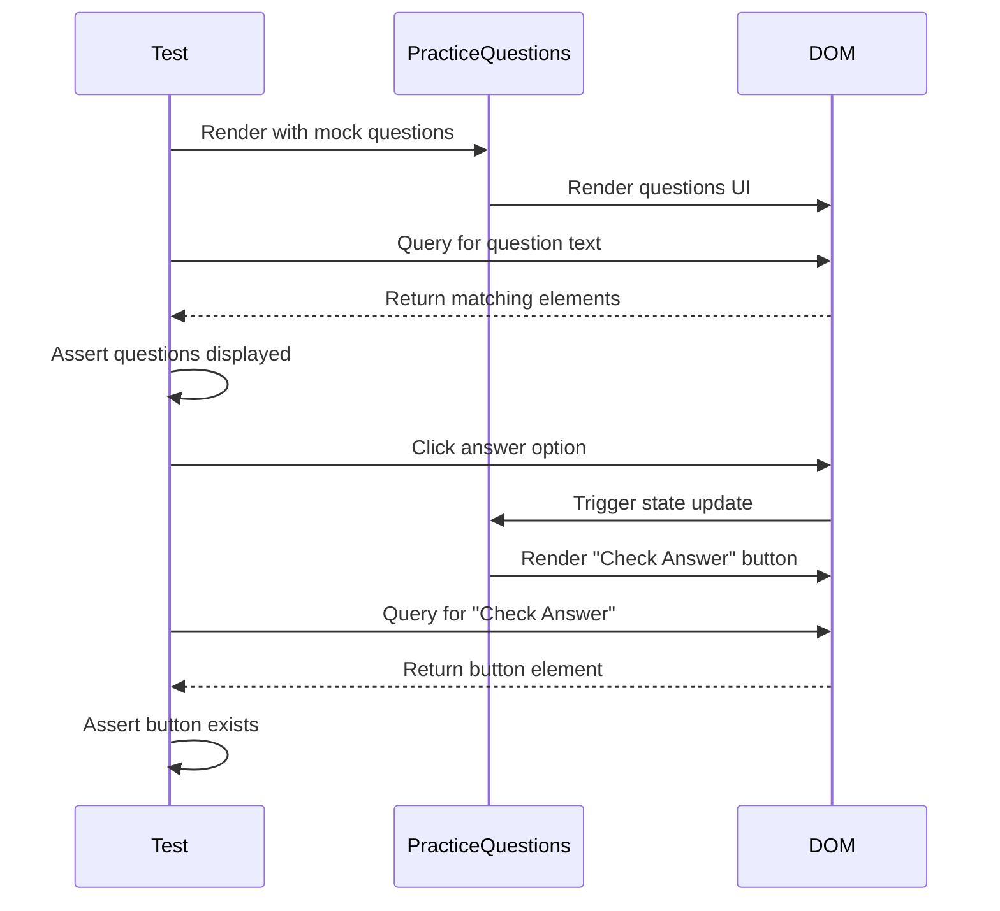

### API Tests

Here's a visualization of the API test flow:

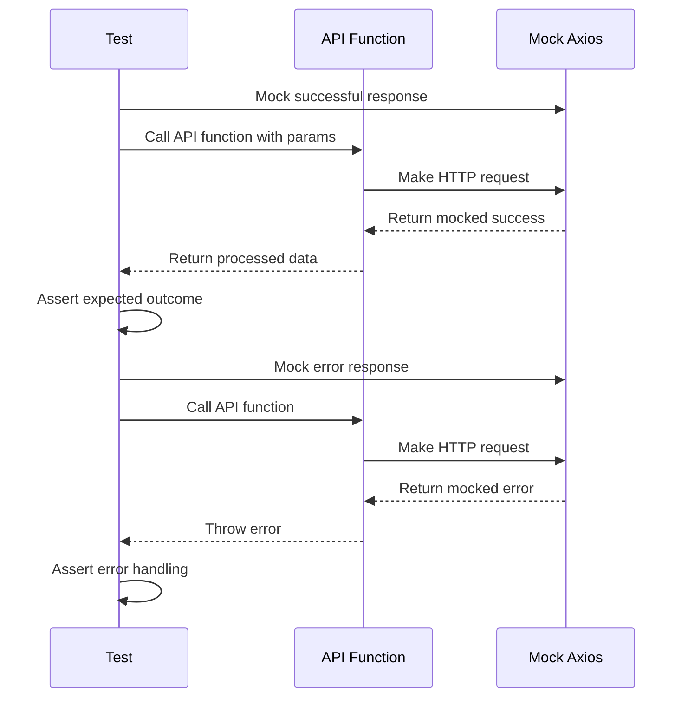

## Test Configuration

LecSlide uses Jest's Next.js integration for seamless testing of Next.js components and API routes:

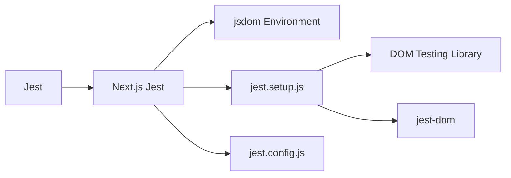